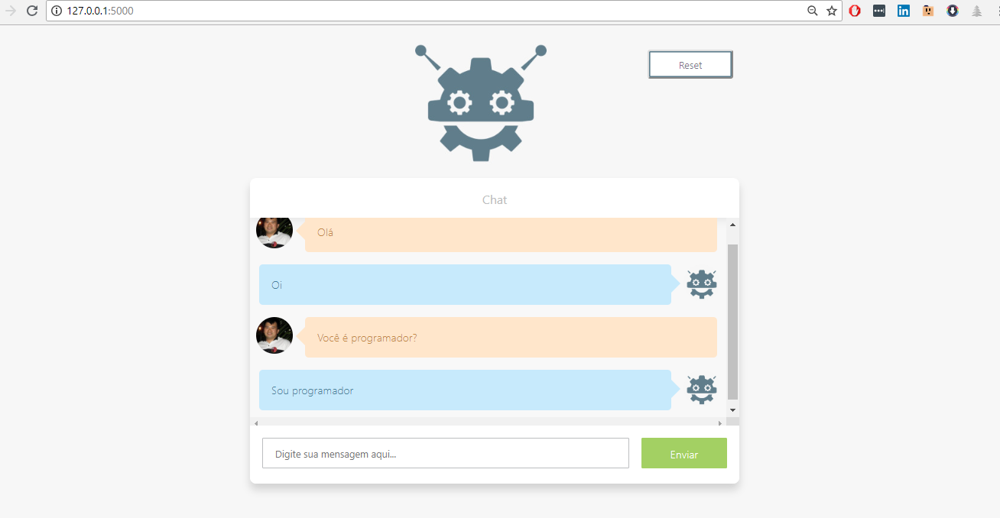

# python-chatbot

Trabalho de Sistemas distribuidos comunicação rpc.
ChatBot web escrito em python e javascript para demostração do uso da interface de comunicação rpc client-servidor.

Backend:
  + [Chatterbot](https://github.com/gunthercox/ChatterBot)
  + [Flask](http://flask.pocoo.org/)
  + [grpc](https://grpc.io/)
  
Frontend em Javascript, html, css puro.

Para executar:
  python greeter_server.py 
  python app.py
  
"
